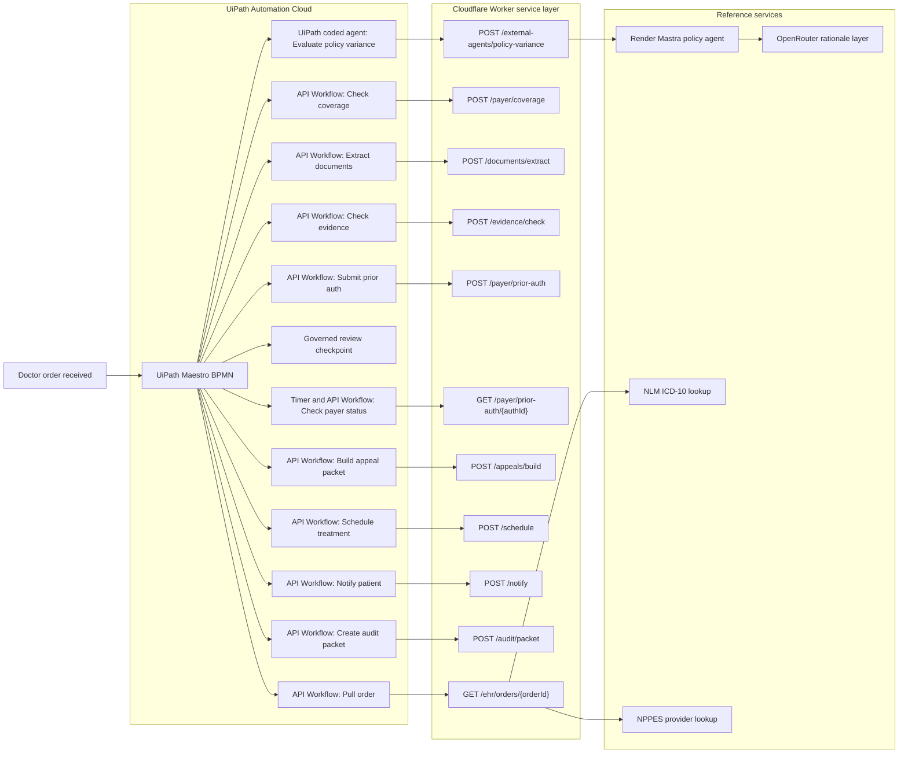

# Covenant Architecture

## System Diagram

## Flow Notes

### 1. Control plane

UiPath Maestro BPMN owns the process model, state transitions, waiting states, and routing decisions. That is the submission-critical layer.

### 2. Service layer

The Cloudflare Worker exposes the public HTTP surface used by the API Workflows. It provides a reproducible backend for coverage checks, extraction, evidence analysis, submission, payer status, scheduling, notification, audit generation, and the public demo run.

### 3. Native coded agent

The repository includes a native UiPath coded agent project in `uipath-coded-agent/`. Its role is to evaluate policy variance under BPMN control using deterministic-first logic with optional LLM enrichment.

### 4. External coded-agent reference

The Render-hosted Mastra service remains available as an external reference participant. It is useful for public validation and comparison, but it does not replace UiPath as the orchestrator.

### 5. Data-contract tolerance

The Worker, local reference server, and coded-agent schemas were hardened to accept both `snake_case` and `camelCase` payloads. This matters because UiPath workflow outputs often surface fields in a different naming style than the backend source contract.

### 6. Reference scenarios

Two reference orders are important for the product story:

- `ORD-XRAY-1002` demonstrates the honest `no_prior_auth` branch
- `ORD-MRI-1001` demonstrates prior auth, missing evidence, denial rescue, appeal, scheduling, and audit completion

### 7. Governed review points

The process contains explicit review checkpoints before high-impact transitions. In the current public reference stack, those checkpoints are modeled in BPMN and supported by service endpoints rather than being positioned as a polished production review UI.

## Why this architecture is submission-strong

- It is clearly BPMN-first and aligns directly to Track 2.
- It shows APIs, coded agents, timers, and review checkpoints in one governed process.
- It covers both straight-through and exception-heavy paths.
- It keeps UiPath as the orchestration layer even when external services are involved.
- It ships a reproducible public backend surface for judges while preserving a native UiPath coded-agent path inside the repo.
